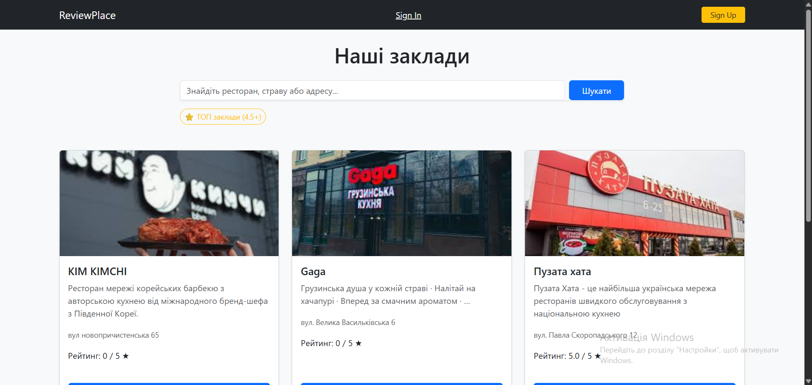
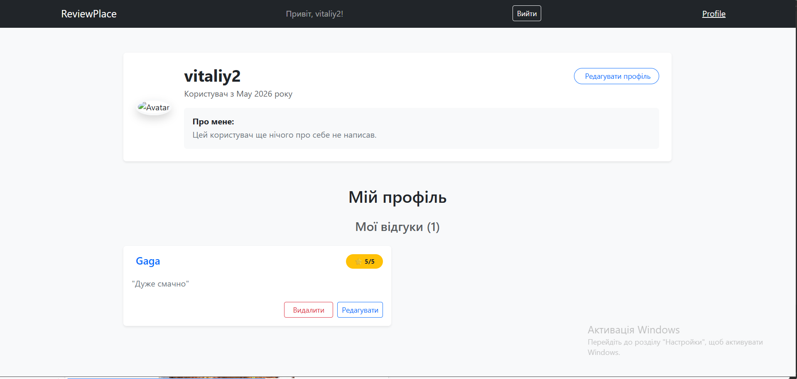
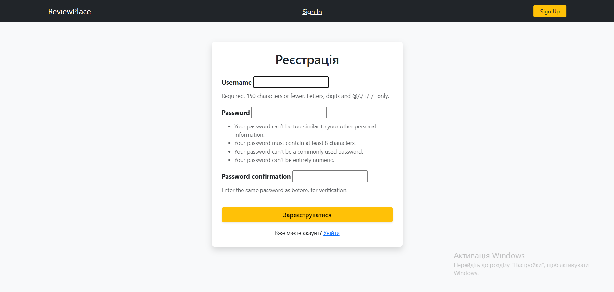
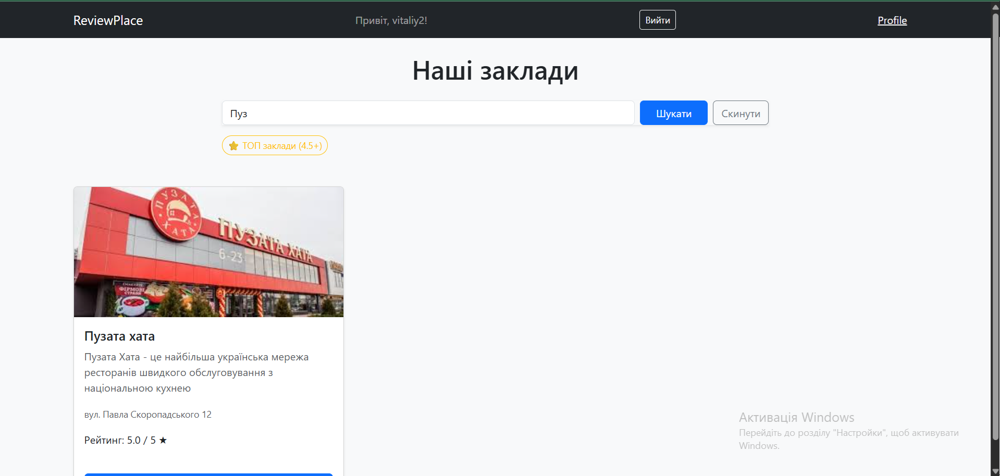
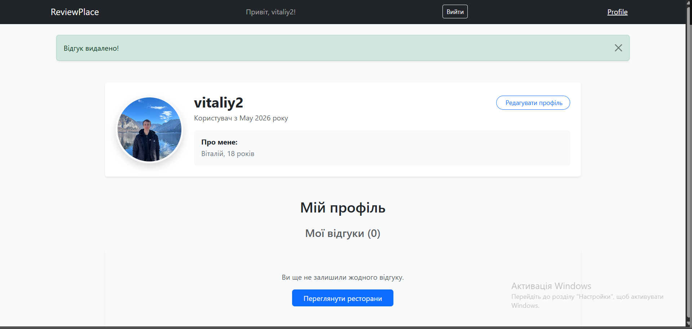
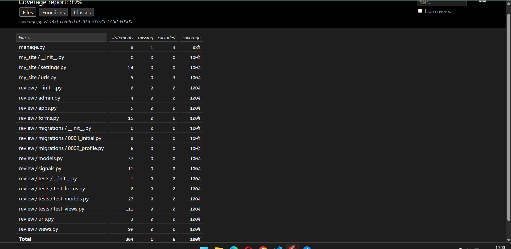

# Restaurant Review Platform

Повнофункціональна веб-платформа для обміну відгуками про заклади харчування, побудована на Django. Проект розроблений з акцентом на автоматизацію розгортання через Docker, оптимізацію запитів до БД та високу надійність коду, підтверджену автоматичними тестами (90%+ coverage).
---

## Технології
* **Backend:** Python 3.13, Django 5.x
* **Database:** PostgreSQL (Docker)
* **Package Management:** Poetry
* **Frontend:** Django Templates, Bootstrap 5
* **DevOps & Tools:** Docker, Docker Compose
* **Testing:** Django Test Suite, Coverage.py

---

## Функціонал
- **Smart Review System:** впроваджено бізнес-логіку "один заклад - один відгук", що запобігає маніпуляціям з рейтингом.
- **Dynamic Ratings:** реалізовано автоматичний розрахунок середнього балу закладу на основі анотацій Django ORM у реальному часі.
- **Advanced Search & Filtering:** гнучкий пошук за назвою чи адресою та швидка фільтрація закладу з найвищим рейтингом (Top Rated 4.5+).
- **User Profiles:** персоналізований кабінет користувача з можливістю редагування даних, керування біографією та системою завантаження аватарок.

---

## Preview (Демонстрація проекту)

| Головна сторінка | Профіль користувача |
|:---:|:---:|
|  |  |

| Авторизація | Пошук та логіка |
|:---:|:---:|
|  |  |

| Система сповіщень | Звіт про тестування |
|:---:|:---:|
|  |  |

---

## Встановлення та запуск

1. **Клонуйте репозиторій:**
   ```bash
   git clone [https://github.com/Vitaliy250507/Review.git](https://github.com/Vitaliy250507/Review.git)
   cd Review
   ```

2. **Налаштуйте оточення:**
   Скопіюйте файл .env.example у свій файл .env.
   ```bash
   cp .env.example .env
   ```
3. **Запустіть проект через Docker Compose:**
   ```bash
   docker-compose up --build
   ```
   Після завершення білду сервіс буде доступний за адресою: http://127.0.0.1:8000
## Quality Assurance & Automation

Проект підтримує високий стандарт якості завдяки автоматизованому процесу тестування.

- **Покриття:** Тести охоплюють моделі, представлення (Views), форми та систему авторизації.
- **Звітність:** Автоматична генерація HTML-звітів `coverage` для візуального аналізу протестованого коду.

Для запуску тестів та генерації звіту виконайте:
```bash
docker-compose exec web rm -f .coverage && \
docker-compose exec web poetry run coverage run manage.py test && \
docker-compose exec web poetry run coverage html && \
docker cp review_django_web:/app/htmlcov ./htmlcov_local
